# Kubernetes
### Planes
Kubernetes architecture, at a high-level can be thought of as a Master Node (or Control Plane) and Worker Nodes.

<!--  -->

	

#
### Components
Some of the components that make up the Master Node and the Worker Node are visualized below.

	

	

#
### High-Level Architecture
The architecture between Master and Worker Nodes can be visualized as follows

#
The Worker Node contains, at the lowest level, an app running in a container.
This pulls in the docker image.
In kubernetes, the smallest unit/component is a pod...so this container is wrapped within a pod.
And that pod runs on a node.

<!--  -->

	

#
### Internal Comms

The API server exposes a ReST api.
Commands sent (eg. kubectl get pods) are sent to via a request

	

 

The communications between components is visualized in the following diagram

	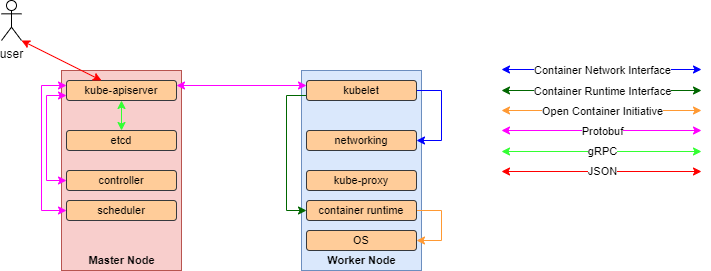

#
## Configs
Kubernetes consumes the config files in order to create the objects required.
As an example, let's consider a simple pod.  
[Pods](https://kubernetes.io/docs/concepts/workloads/pods/) are the smallest deployable units of computing that you can create and manage in Kubernetes.  
We can create this pod via the imperative method, or the declarative method. For just now, let us ignore these definitions.  
We shall re-visit this shortly.
Let's 
1. create a pod config/file, 
2. apply this, 
3. Interrogate and see this in Kubernetes

 

### Creating a sample Pod Config
Create a file, with the yaml extension (as below).  

	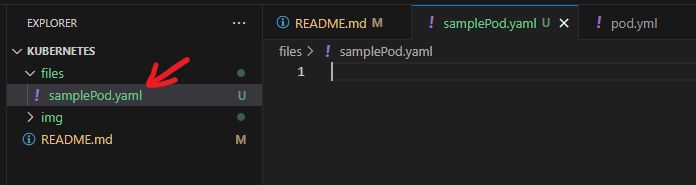

 

This file is blank (for now; below).  
Now, we create the config.  

	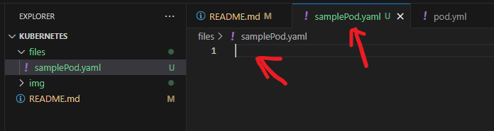

 

In the newly created blank yaml file, start typing out <strong>pod</strong>.  
VS Code intellisense kicks in and gives us the option to apply a Kubernetes pod template.  

	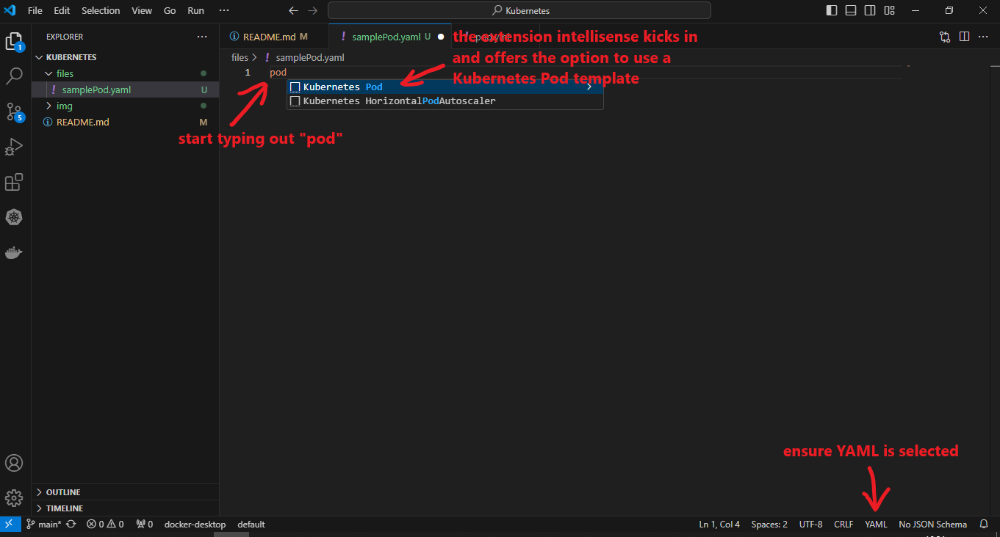

 

Click on the option for pod and we see as follows  

	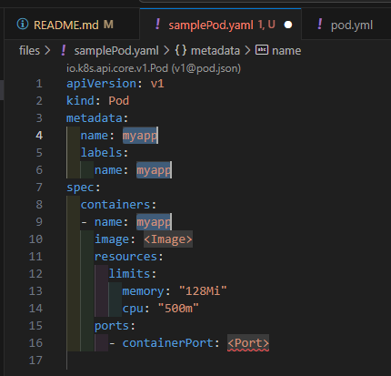

 

Now, we'll edit this file to create a barebones sample pod.  
We'll just rename the spec name to nginx and the image to pull the latest nginx image.  

	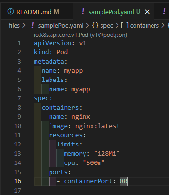

### Applying the sample Pod Config
Ok. We have the config. Now what?  
In order to see this in action, we need to apply this in Kubernetes.  
Ensure that Kubernetes is running (I have docker-desktop installed, and started).  
As can be seen, there's no pods running.

	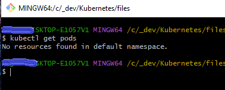

 

	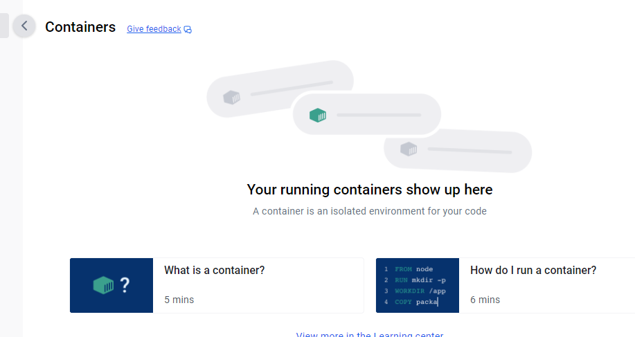

 

We apply the config using the command
  - kubectl apply -f <filename>
    eg. kubectl apply -f samplePod.yaml  

And querying the pods, we see as follows.  

 

	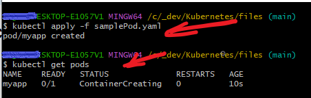

 

Let's apply port-fowarding so that we can reach the pod.
We can do this via the command
  - kubectl port-forward localport:remoteport
    eg. kubectl port-forward 1122:80  

 

	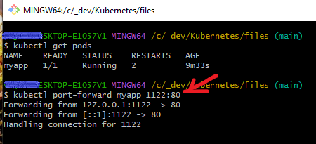

 

Navigating in the browser, we see as follows.

	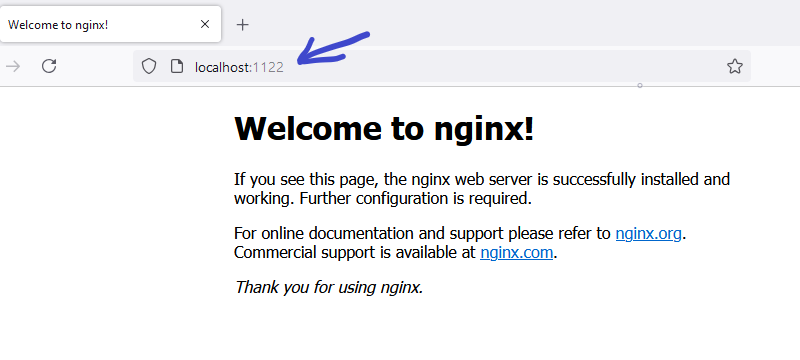

 

#
## Links
[Kubernetes Internals](https://github.com/shubheksha/kubernetes-internals)
