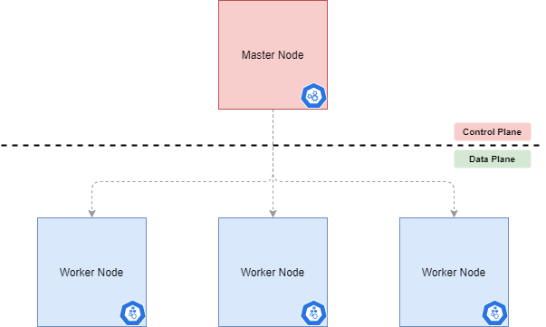
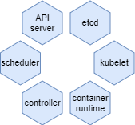
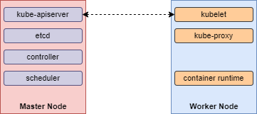
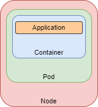

# Kubernetes
Kubernetes architecture, at a high-level can be thought of as a Master Node (or Control Plane) and Worker Nodes.

#

Some of the components that make up the Master Node and the Worker Node are visualized below.

#
The architecture between Master and Worker Nodes can be visualized as follows

#
The Worker Node contains, at the lowest level, an app running in a container.
This pulls in the docker image.
In kubernetes, the smallest unit/component is a pod...so this container is wrapped within a pod.
And that pod runs on a node.

#
